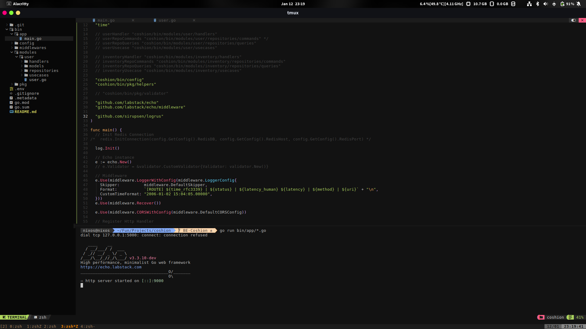

## Coshion Backend API Documentation

### Team Member
- **Galih Putra Windawan** - *Hustler*
- **Lukman Nur Hakim** - *Hacker*
- **Hidayat Taufiqur Rahmah Achmad** - *Hacker*
- **Moza Sajidah Putri Al Muzaffar** - *Hipster*

## Latest Progress - Coshion Backend 

## How to Run this Backend 
To get the Coshion Backend up and running on your local machine, follow these steps:

1. **Environment Setup**:
   - Duplicate the `.env.example` file and rename the copy to `.env`.
   - Edit the `.env` file to set the required environment variables according to your setup.

2. **Install Dependencies**:
   - Run the command `make install` in your terminal. This command will download and install necessary Go modules and dependencies for the project.

3. **Start the Application**:
   - Execute `make run` to start the application. This command compiles and runs the Go application as defined in the project's `Makefile`.

### Notes
- Ensure that `make` and `Go` are properly installed on your system before executing the commands.
- The project’s `.env` file contains sensitive information; do not share it publicly.
